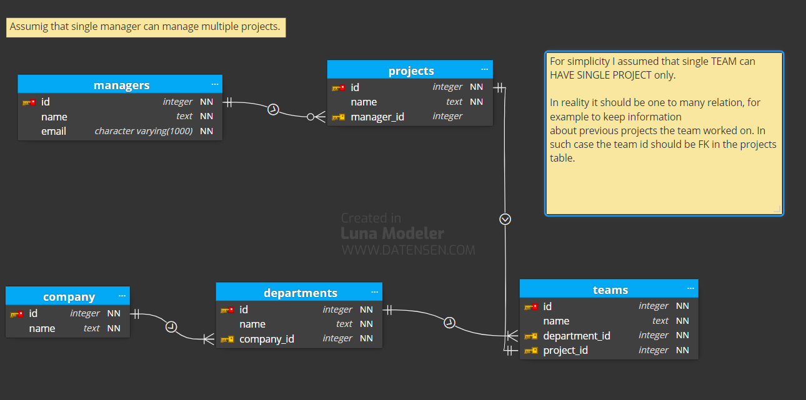

# README #

### What is this repository for? ###

* This repository contains an application codebase which is recruitment task solution for the java developer position. 
* The application is based on spring-boot nad JAVA, as well as PostgreSQL
* 1.0
### The Task ###
1. Entity Structure: The main entity is the Company.
   * Each company has a name and includes departments.
   * Each department has a name and contains teams.
   * Each team has a name and is assigned to a project.
   *  Each project is managed by a manager, who has a name and email.
2. REST API:
   *Implement a RESTful API that supports CRUD operations for the Company entity.
   * All interactions with departments, teams, and projects should be handled through this
   single Company controller.

### How to build and run? ###

In order to build this app you need:
* JAVA 17 but it was also tested on JAVA 21
* Maven 3.6.3 or later 
* PostrgreSQL 17

#### Build and run on local host 
1. `git clone` current repository
2. set up PostgreSQL on you local host. Create empty db/user/pass.
3. Go to main project directory
4. Set up db connection in src/main/resources/application.properties
5. `mvn clean package`
6. Make sure 8080 port is not being used by ather app  
6. `java -jar target/luxmed-rest-app.jar`
#### Run precompiled binaries in Docker container
Together with source files, already built application is also delivered.
The executable JAR file is located in /dist directory that can be run using 
 Dockerfile and docker-compose.yml which are also provided.     

To get the app running in docker container it is required to:
1. Have Docker engine installed locally
2. Go to main project directory 
3. `docker-compose up`

### Things that could be still done  ###
* Unit tests
* Add swagger for easier endpoints usage
* Add profiles handling 
* Add logging handling

